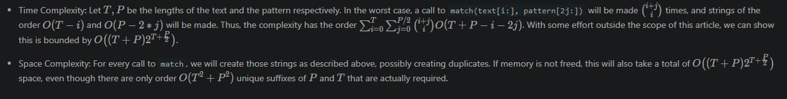

# 10. Regular Expression Matching

## 題目

---

Given an input string `s` and a pattern `p`, implement regular expression matching with support for `'.'` and `'*'` where:

- `'.'` Matches any single character.
- `'*'` Matches zero or more of the preceding element.

The matching should cover the **entire** input string (not partial).

**Example 1:**

```
Input: s = "aa", p = "a"
Output: false
Explanation: "a" does not match the entire string "aa".

```

**Example 2:**

```
Input: s = "aa", p = "a*"
Output: true
Explanation: '*' means zero or more of the preceding element, 'a'. Therefore, by repeating 'a' once, it becomes "aa".

```

**Example 3:**

```
Input: s = "ab", p = ".*"
Output: true
Explanation: ".*" means "zero or more (*) of any character (.)".

```

**Constraints:**

- `1 <= s.length <= 20`
- `1 <= p.length <= 30`
- `s` contains only lowercase English letters.
- `p` contains only lowercase English letters, `'.'`, and `'*'`.
- It is guaranteed for each appearance of the character `'*'`, there will be a previous valid character to match.

## 思路

---

- Recursive
    - If pattern length is 0, string is matched only when length of string is 0.
    - Compare first string and pattern
    - If second pattern is `*`, there are two  conditions:
        - previous string appears 0 time
            
            `isMatch(s, p[2:])`
            
        - previous string appears multiple time
            
            `isMatch(s[1:], p)`
            
    - If second pattern is not `*`, s and p move to next
        
        `firstMatched && isMatch(s[1:], p[1:])`
        
    - Complexity
        
        
        
- Dynamic Programming
    - we use `dp(i, j)`
    `dp(i, j)` to handle those calls instead, saving us expensive string-building operations and allowing us to cache the intermediate results.
    - Complexity
        
        
        

## Code

---

- GoLang
    - Recursive
        
        Runtime: 15 ms, faster than 37.20% of Go online submissions for Regular Expression Matching.
        Memory Usage: 2.1 MB, less than 87.68% of Go online submissions for Regular Expression Matching.
        
        ```go
        func isMatch(s string, p string) bool {
            if len(p) == 0 {
                return len(s) == 0
            }
            
            firstMatched := len(s) != 0 && (s[0] == p[0] || p[0] == '.')
            if len(p) >= 2 && p[1] == '*' {
                return  isMatch(s, p[2:]) || (firstMatched && isMatch(s[1:], p))
            } else {
                return firstMatched && isMatch(s[1:], p[1:])
            }
        }
        ```
        
    - Dynamic Programming
        
        Runtime: 0 ms, faster than 100.00% of Go online submissions for Regular Expression Matching.
        Memory Usage: 2.8 MB, less than 24.51% of Go online submissions for Regular Expression Matching.
        
        ```go
        var result [][]int;
        
        func isMatch(s string, p string) bool {
            result = make([][]int, len(s) + 1)
            for i, _ := range result {
                result[i] = make([]int, len(p) + 1)
            }
            
            return dp(0, 0, s, p)
        }
        
        func dp(i, j int, s, p string) bool {
            if r := result[i][j]; r != 0 {
                if r == 1 {
                    return true
                } else {
                    return false
                }
            }
            
            var ans bool
            
            if len(p) == j {
                ans = len(s) == i
            } else {
                firstMatched := i < len(s) && (s[i] == p[j] || p[j] == '.')
                if j+1 < len(p) && p[j+1] == '*' {
                    ans = dp(i, j+2, s, p) || (firstMatched && dp(i+1, j, s, p))
                } else {
                    ans = firstMatched && dp(i+1, j+1, s, p)
                }
            }
            
            
            if ans {
                result[i][j] = 1
            } else {
                result[i][j] = -1
            }
            
            return ans
        }
        ```
        

## Reference

---

- [https://www.cnblogs.com/grandyang/p/4461713.html](https://www.cnblogs.com/grandyang/p/4461713.html)
- [https://blog.csdn.net/L141210113/article/details/87925786](https://blog.csdn.net/L141210113/article/details/87925786)