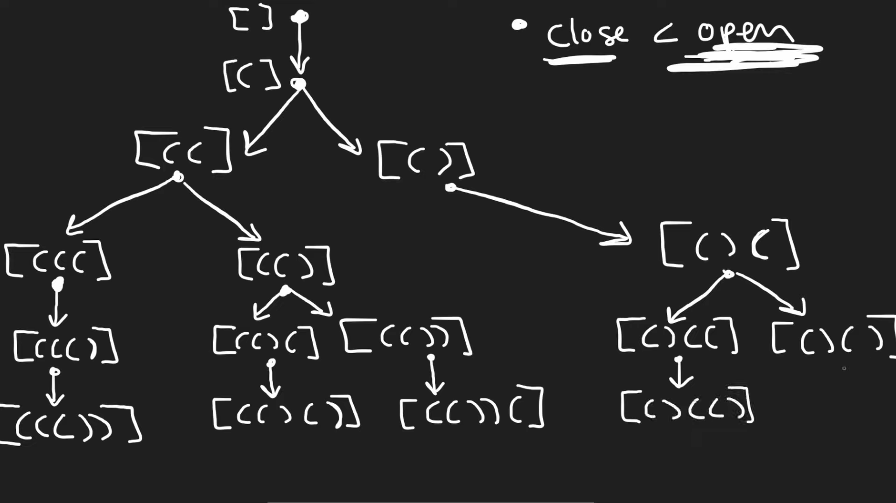

# 22. Generate Parentheses

## Problem

---

Given `n` pairs of parentheses, write a function to *generate all combinations of well-formed parentheses*.

**Example 1:**

```
Input: n = 3
Output: ["((()))","(()())","(())()","()(())","()()()"]

```

**Example 2:**

```
Input: n = 1
Output: ["()"]

```

**Constraints:**

- `1 <= n <= 8`

## Note

---

- Backtracking
    1. Open parentheses only allowed to add when `amount of open parentheses` less than `n`
    2. Closed parentheses only allowed to add when `amount of open parentheses` greater than `amount of closed parentheses`
    3. when `mount of open parentheses` equals to `amount of closed parentheses` and equals to `n`  is end.
    
    
    

## Code

---

- PHP
    
    Runtime **10**ms Beats**48.94%**of users with PHP
    
    Memory **20.37**MB Beats**18.09%**of users with PHP
    
    ```php
    class Solution {
    
        /**
         * @param Integer $n
         * @return String[]
         */
        function generateParenthesis($n) {
            $stack = [];
            $result = [];
    
            $backtrack = function(int $openP, int $closedP) use (&$stack, &$result, $n, &$backtrack) {
                if ($openP === $closedP && $closedP === $n) {
                    $result[] = implode('', $stack);
                    return;
                }
    
                if ($openP < $n) {
                    $stack[] = "(";
                    $backtrack($openP + 1, $closedP);
                    array_pop($stack);
                }
    
                if ($openP > $closedP) {
                    $stack[] = ")";
                    $backtrack($openP, $closedP + 1);
                    array_pop($stack);
                }
            };
    
            $backtrack(0, 0);
    
            return $result;
        }
    }
    ```
    
- GoLang
    
    Runtime **2**ms Beats **75.00%** of users with Go
    
    Memory **2.71**MB Beats **72.08%** of users with Go
    
    ```go
    func generateParenthesis(n int) []string {
        stack := make([]string, 0)
    
        var backtrack func(openedP, closedP int)
        result := make([]string, 0)
        
        backtrack = func(openedP, closedP int) {
            if openedP == closedP && closedP == n {
                result = append(result, strings.Join(stack, ""))
                return
            }
    
            if openedP < n {
                // push
                stack = append(stack,"(")
                backtrack(openedP + 1, closedP)
                // pop
                stack = stack[:len(stack)-1]
            }
    
            if openedP > closedP {
                // push
                stack = append(stack,")")
                backtrack(openedP, closedP + 1)
                // pop
                stack = stack[:len(stack)-1]
            }
        }
    
        backtrack(0, 0)
    
        return result
    }
    
    ```
    

## Reference

---