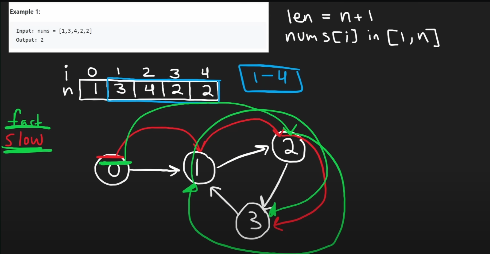
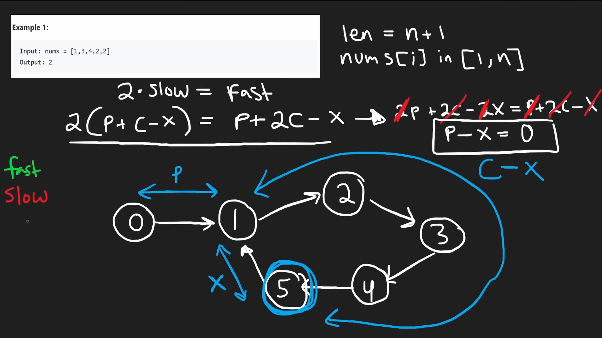

# 287. Find the Duplicate Number

## 題目

Given an array of integers `nums` containing `n + 1` integers where each integer is in the range `[1, n]` inclusive.

There is only **one repeated number** in `nums`, return *this repeated number*.

You must solve the problem **without** modifying the array `nums` and uses only constant extra space.

**Example 1:**

```
Input: nums = [1,3,4,2,2]
Output: 2

```

**Example 2:**

```
Input: nums = [3,1,3,4,2]
Output: 3

```

**Example 3:**

```
Input: nums = [1,1]
Output: 1

```

**Example 4:**

```
Input: nums = [1,1,2]
Output: 1

```

**Constraints:**

- `1 <= n <= 10^5`
- `nums.length == n + 1`
- `1 <= nums[i] <= n`
- All the integers in `nums` appear only **once** except for **precisely one integer** which appears **two or more** times.

**Follow up:**

- How can we prove that at least one duplicate number must exist in `nums`?
- Can you solve the problem in linear runtime complexity?

## 思路

- Method 1 - HashTable
    
    Iterate all element and use hash Table to find repeat element
    
    - Use value as key. If element's value is setted, return this element.
    - Time Complexity: O(N)
    - Space Complexity: O(N)
- Method 2 - Sort & Iteratively Check
    - Sort array
    - Compare element with next element. If same return this element.
    - Time Complexity: O(nlogn)
    - Space Complexity:
        - Not change original array: O(nlogn)
        - Use original array: O(1)
- Method 3 - Binary Search
    - element is `1 <= element <= n`
    - calculate mid number and iterate every element, then calculate element number that less than mid number (`counter`).
    - If `counter ≥  mid`, it mean that repeat element is between 1 and mid.
    - If `counter < mid`, it mean that repeat element is between mid and n.
    - Time Complexity: O(nlogn)
    - Space Complexity: O(1)

- **Floyd's Cycle Detection**
    - Find start point of cycle
    - Treat array value as pointer
        - value is 1 - n, so 0 must the start point
    - Using slow, fast pointer
    
    
    



## Code

- PHP
    - Method 1 - Hash Table
        
        ```php
        class Solution {
        
            /**
             * @param Integer[] $nums
             * @return Integer
             */
            function findDuplicate($nums) {
                $hashMap = [];
                $size = count($nums);
                
                for ($i = 0; $i < $size; $i++) {
                    if (!isset($hashMap[$nums[$i]])) {
                        $hashMap[$nums[$i]] = true;
                        continue;
                    }
                    return $nums[$i];
                }
            }
        }
        ```
        
    - Method 2 - sort
        
        ```php
        class Solution {
        
            /**
             * @param Integer[] $nums
             * @return Integer
             */
            function findDuplicate($nums) {
                sort($nums);
                $size = count($nums);
                
                for ($i = 0; $i < $size - 1; $i++) {
                    if ($nums[$i] === $nums[$i+1]) {
                        return $nums[$i];
                    }
                }
                return false;
            }
        }
        ```
        
    - Method 3 - Binary Search
        
        ```php
        class Solution {
        
            /**
             * @param Integer[] $nums
             * @return Integer
             */
            function findDuplicate($nums) {
                $n = count($nums) - 1;
                $min = 1;
                $max = $n;
                while ($min != $max) {
                    $counter = 0;
                    $mid = intval(($min+$max)/2);
                    foreach ($nums as $num) {
                        if ($num <= $mid) {
                            $counter++; 
                        }
                    }
                    
                    if ($counter > $mid) {
                        $max = $mid;
                    }else{
                        $min = $mid + 1;
                    }
                }
                return $min;
            }
        }
        ```
        
- GoLang
    - HashTable
        
        Time Complexity: `O(N)`
        
        Space Complexity: `O(N)`
        
        ```go
        func findDuplicate(nums []int) int {
            numMap := make(map[int]bool)
            
            for _, num := range nums {
                if numMap[num] {
                    return num
                }
        
                numMap[num] = true
            }
        
            return -1
        }
        ```
        
    - Floyd's Cycle Detection
        
        Time Complexity: `O(N)`
        
        Space Complexity: `O(1)`
        
        ```go
        func findDuplicate(nums []int) int {
            slow, fast := nums[0], nums[nums[0]]
        
            // find first intersect, slow pointer shift 1 by 1, fast pointer shift 2 by 2
            for slow != fast {
                slow = nums[slow]
                fast = nums[nums[fast]]
            }
        
            // find secod intersect, two pointer shift 1 by 1
            slow = 0
            for slow != fast {
                slow = nums[slow]
                fast = nums[fast]
            }
        
            return slow
        }
        ```
        

## Reference

- [https://www.youtube.com/watch?v=wjYnzkAhcNk&embeds_referring_euri=https%3A%2F%2Fneetcode.io%2F&source_ve_path=MjM4NTE&feature=emb_title](https://www.youtube.com/watch?v=wjYnzkAhcNk&embeds_referring_euri=https%3A%2F%2Fneetcode.io%2F&source_ve_path=MjM4NTE&feature=emb_title)
- [https://www.youtube.com/watch?v=PvrxZaH_eZ4&ab_channel=Insidecode](https://www.youtube.com/watch?v=PvrxZaH_eZ4&ab_channel=Insidecode)