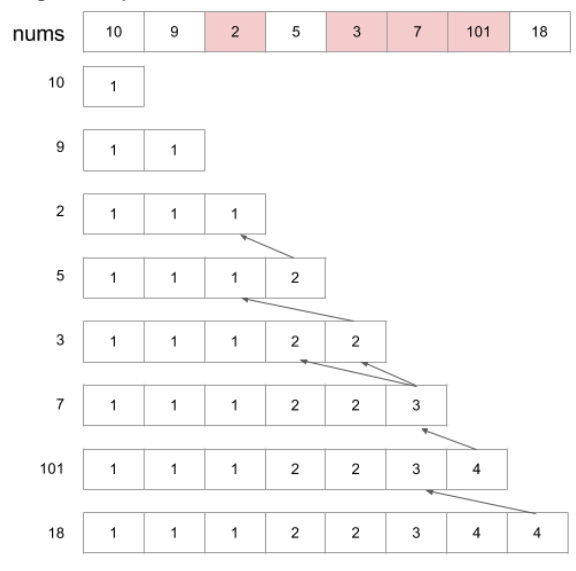
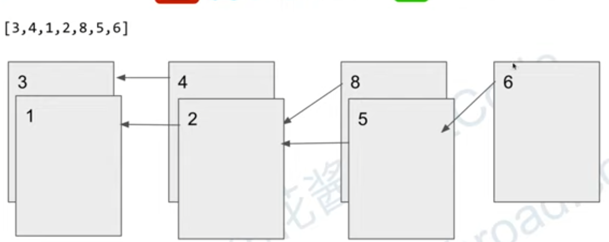

# 300. Longest Increasing Subsequence

## 題目

Given an integer array `nums`, return the length of the longest strictly increasing subsequence.

A **subsequence** is a sequence that can be derived from an array by deleting some or no elements without changing the order of the remaining elements. For example, `[3,6,2,7]` is a subsequence of the array `[0,3,1,6,2,2,7]`.

**Example 1:**

```
Input: nums = [10,9,2,5,3,7,101,18]
Output: 4
Explanation: The longest increasing subsequence is [2,3,7,101], therefore the length is 4.

```

**Example 2:**

```
Input: nums = [0,1,0,3,2,3]
Output: 4

```

**Example 3:**

```
Input: nums = [7,7,7,7,7,7,7]
Output: 1

```

**Constraints:**

- `1 <= nums.length <= 2500`
- `-10^4 <= nums[i] <= 10^4`

## 思路

- Dynamic Programming & Brute Force
    - 計算第0個元素,  第0~1個元素, 第0~2個元素, ... 第0~n個元素的最大子序列長度。
    - 計算時存下每個結果，並且在計算下一個元素時使用上一個結果來計算 (1 or 上一個結果 + 1)  ※ Dynamic Programming
    - 最後求出所有可能的子序列長度中最大的解答
    - 可使用遞迴或loop求解
    - Time Complexity: O(n^2)
    - Space Complexity: O(n)
    - 參考圖示

        

- Dynamic Programming & Binary Search
    - 迭代每個數字，並執行:
        1. 增加最長子序列長度(append to dp)
        2. 替換一個數字以產生更好的子序列，只要尾數不變就不影響結果，因為題目只求長度
    - Time Complexity: O(nlogn)
    - Space Complexity: O(n)
    - 參考圖示

        

        - Patience Sort

        

## Code

- PHP
    - Dynamic Programming & Brute Force
        - Loop

            ```php
            class Solution {

                /**
                 * Runtime: 976 ms, faster than 40.00% of PHP online submissions for Longest Increasing Subsequence.
                 * Memory Usage: 16.1 MB, less than 50.00% of PHP online submissions for Longest Increasing Subsequence.
                 * @param Integer[] $nums
                 * @return Integer
                 */
                function lengthOfLIS($nums) {
                    $n = count($nums);
                    /** 紀錄只有第0個元素, 第0~1個元素, .... 第0~n個元素 的最大子序列長度 */
                    $dp = array_fill(0, $n, 1);

                    for ($i = 1; $i < $n; $i++) {
                        for ($j = 0; $j < $i; $j++) {
                            if ($nums[$i] > $nums[$j]) {
                                /** 0~$i 元素組成的最大子序列長度為 $dp[$i](此元素預設值1) 或 $dp[$j] + 1 (上一個元素的長度 + 1)  */
                                $dp[$i] = max($dp[$i], $dp[$j] + 1);
                            }
                        }
                    }
                    /** 找出所有長度中的最大值 */
                    return max($dp);
                }
                
            }
            ```

        - Recursive

            ```php
            class Solution {

                private $result = [];
                /**
                 * Runtime: 1544 ms, faster than 26.67% of PHP online submissions for Longest Increasing Subsequence.
                 * Memory Usage: 16.3 MB, less than 10.00% of PHP online submissions for Longest Increasing Subsequence.
                 * @param Integer[] $nums
                 * @return Integer
                 */
                function lengthOfLIS($nums) {
                    $n = count($nums);
                    if ($n === 0) {
                        return 0;
                    }
                    
                    $ans = 0;
                    for ($i = 0; $i < $n; $i++) {
                        $ans = max($ans, $this->getLIS($nums, $i));
                    }
                    return $ans;
                }
                
                function getLIS($nums, $r) {
                    if ($r === 0) {
                        return 1;
                    }
                    if (isset($this->result[$r])) {
                        return $this->result[$r];
                    }
                    
                    $ans = 1;
                    
                    for ($i = 0; $i < $r; $i++) {
                        if ($nums[$r] > $nums[$i]) {
                            $ans = max($ans, $this->getLIS($nums, $i) + 1);
                        }
                    }
                    $this->result[$r] = $ans;
                    return $this->result[$r];
                }
            }
            ```

    - Dynamic Programming & Binary Search

        ```php
        class Solution {

            /**
             * @param Integer[] $nums
             * @return Integer
             */
            function lengthOfLIS($nums) {
                $dp = [];
                $dp[] =  $nums[0];
                
                foreach ($nums as $num) {
                    if ($num > end($dp)) { // 如果此數字比目前array中最後一個數字大的話就直接放到array
                        $dp[] = $num;
                    } else { // 若比當前位數小，將其替掉 <= 此數的數字
                        for ($j = 0; $j < count($dp); $j++) {
                            if ($dp[$j] >= $num) {
                                $dp[$j] = $num;
                                break;
                            }
                        }
                    }
                }

                return count($dp);
            }
        }
        ```
- GoLang
    - Dynamic Programming & Brute Force
        - Loop
            
            Runtime: 80 ms, faster than 32.85% of Go online submissions for Longest Increasing Subsequence.
            Memory Usage: 3.8 MB, less than 40.59% of Go online submissions for Longest Increasing Subsequence.
            
            ```go
            func lengthOfLIS(nums []int) int {
                length := len(nums)
                dp := make([]int, length)
                
                // set default value
                for i := 0; i < length; i++ {
                    dp[i] = 1
                }
                
                for i := 1; i < length; i++ {
                    for j := 0; j < i; j++ {
                        
                        if nums[i] > nums[j] {
                            dp[i] = max(dp[i], dp[j] + 1)
                        }
                    }
                }
                
                maxCount := 0
                for _, count := range dp {
                    maxCount = max(maxCount, count)
                }
                
                
                return maxCount
            }
            
            func max(x, y int) int {
                if x > y {
                    return x
                }
                
                return y
            }
            ```
            
        - Recursive
            
            
    - Dynamic Programming & Binary Search
        
        Runtime: 15 ms, faster than 76.97% of Go online submissions for Longest Increasing Subsequence.
        Memory Usage: 3.6 MB, less than 88.80% of Go online submissions for Longest Increasing Subsequence.
        
        ```go
        func lengthOfLIS(nums []int) int {
            
            length := len(nums)
            dp := make([]int, length)
            index := 1
            dp[0] = nums[0]
        
            for i := 1; i < length; i++  {
                if nums[i] > dp[index-1] {
                    dp[index] = nums[i]
                    index++
                } else {
                    for j := 0; j < index; j++ {
                        if dp[j] >= nums[i] {
                            dp[j] = nums[i]
                            break
                        }
                    }
                }
            }
            
            return index
        }
        ```


## Reference

* [花花酱 LeetCode 300. Longest Increasing Subsequence](https://zxi.mytechroad.com/blog/dynamic-programming/leetcode-300-longest-increasing-subsequence/)
* [[LeetCode] 300. Longest Increasing Subsequence 最长递增子序列](https://www.cnblogs.com/grandyang/p/4938187.html)