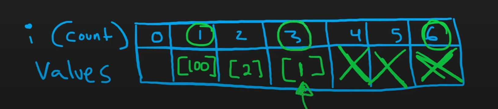

# 347. Top K Frequent Elements

## 題目

---

Given an integer array `nums` and an integer `k`, return *the* `k` *most frequent elements*. You may return the answer in **any order**.

**Example 1:**

```
Input: nums = [1,1,1,2,2,3], k = 2
Output: [1,2]

```

**Example 2:**

```
Input: nums = [1], k = 1
Output: [1]

```

**Constraints:**

- `1 <= nums.length <= 10^5`
- `10^4 <= nums[i] <= 10^4`
- `k` is in the range `[1, the number of unique elements in the array]`.
- It is **guaranteed** that the answer is **unique**.

**Follow up:** Your algorithm's time complexity must be better than `O(n log n)`, where n is the array's size.

## 思路

---

- Use Map record number to count map
- Pick Top k by value, there are multiple way:
    - Sort by Map  value  → `O(nlogn)`
    - Using `heap`  , push all element to heap , then pop k time
    - Bucket Sort
        - Create a count values map
        
        
        

## Code

---

- GoLang - Sort
    
    Runtime 8 **ms** Beats 91.66**%**
    
    Memory **7 MB** Beats **7.5%**
    
    - Time Complexity: `O(nlogn)`  -  create map `O(n)`, copy map `O(n)`, sort slice `O(nlogn)`
    - Space Complexity: `O(n)`
    
    ```go
    type countSlice struct {
        Number int
        Count int
    }
    
    func topKFrequent(nums []int, k int) []int {
        numCount := make(map[int]int)
        for _, num := range nums {
            numCount[num] += 1
        }
        
        countSlices := make([]countSlice, 0, len(nums))
        for num, count := range numCount {
            countSlices = append(countSlices, countSlice{ Number: num, Count: count})
        }
    
        // Sort the slice by the values in descending order
        sort.Slice(countSlices, func(a, b int) bool {
            return countSlices[a].Count > countSlices[b].Count
        })
        kTop := make([]int, 0)
    
        for i := 0; i < k; i++ {
            kTop = append(kTop, countSlices[i].Number)
        }
    
        return kTop
    }
    ```
- GoLang - Heap
    
    Runtime **10**ms Beats **75.26%** of users with Go
    
    Memory **5.99** MB Beats **94.82%** of users with Go
    
    Time Complexity: `O(nlogn)`
    
    Space Complexity: `O(n)`
    
    ```go
    type countSlice struct {
        Number int
        Count int
    }
    
    func topKFrequent(nums []int, k int) []int {
        numCount := make(map[int]int)
        for _, num := range nums {
            numCount[num] += 1
        }
    
        maxHeap := binaryheap.NewWith(func(a, b interface{}) int {
            countSlice1 := a.(countSlice)
            countSlice2 := b.(countSlice)
    
            if countSlice1.Count < countSlice2.Count {
                return 1
            } else if countSlice1.Count > countSlice2.Count {
                return -1
            } else {
                return 0
            }
        })
    
        for num, count := range numCount {
            maxHeap.Push(countSlice{ Number: num, Count: count})
        }
    
        kTop := make([]int, 0)
    
        for i := 0; i < k; i++ {
            c, _ := maxHeap.Pop()
            kTop = append(kTop, c.(countSlice).Number)
        }
        
        return kTop
    }
    ```

- GoLang - Bucket sort
    
    Runtime **6**ms Beats **95.98%**  of users with Go
    
    Memory **6.65**MB Beats **15.92%** of users with Go
    
    Time Complexity: `O(n)`
    
    Space Complexity: `O(n)`
    
    ```go
    func topKFrequent(nums []int, k int) []int {
        numCount := make(map[int]int)
        for _, num := range nums {
            numCount[num] += 1
        }
        
        countSlices := make([][]int, len(nums)+1)
        for num, count := range numCount {
            countSlices[count] = append(countSlices[count], num)
        }
        
    
        kTop := make([]int, 0)
    
        for i := len(countSlices) - 1; i > 0 ; i-- {
            kTop = append(kTop, countSlices[i]...)
            if len(kTop) == k {
                break
            }
        }
       
        return kTop
    }
    ```
    

## Reference

---

- [https://www.youtube.com/watch?v=YPTqKIgVk-k&ab_channel=NeetCode](https://www.youtube.com/watch?v=YPTqKIgVk-k&ab_channel=NeetCode)