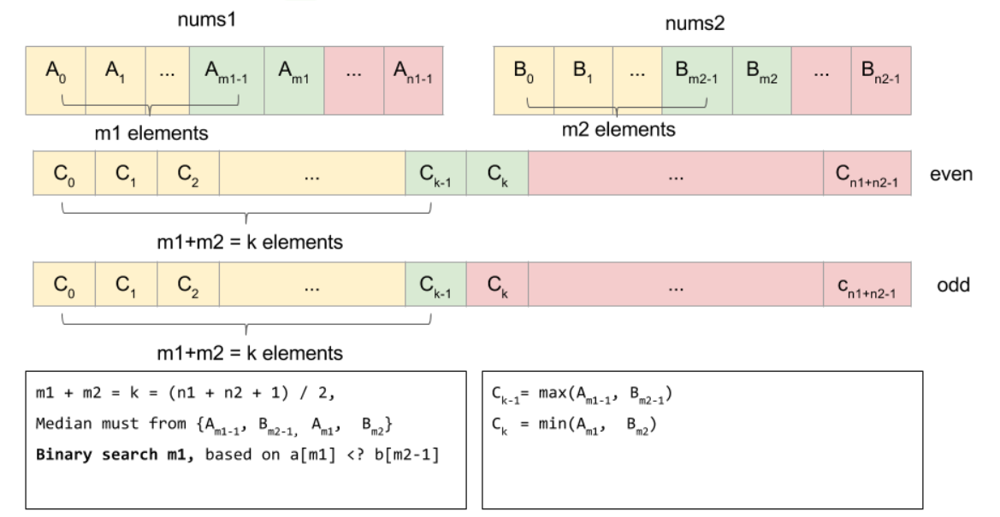

# 4. Median of Two Sorted Arrays

## 題目

---

Given two sorted arrays `nums1` and `nums2` of size `m` and `n` respectively, return **the median** of the two sorted arrays.

The overall run time complexity should be `O(log (m+n))`.

**Example 1:**

```
Input: nums1 = [1,3], nums2 = [2]
Output: 2.00000
Explanation: merged array = [1,2,3] and median is 2.

```

**Example 2:**

```
Input: nums1 = [1,2], nums2 = [3,4]
Output: 2.50000
Explanation: merged array = [1,2,3,4] and median is (2 + 3) / 2 = 2.5.

```

**Constraints:**

- `nums1.length == m`
- `nums2.length == n`
- `0 <= m <= 1000`
- `0 <= n <= 1000`
- `1 <= m + n <= 2000`
- `106 <= nums1[i], nums2[i] <= 106`

## 思路

---

- $O(N)$ - merged two sorted array, then take median
    1. merged two sorted array.  cost `O(N)` time.
    2. take the median.
- $O(log(m+n))$
    
    
    
    
    

## Code

---

- `O(N)`
    - GoLang
        - Runtime: 8 ms, faster than 96.46% of Go online submissions for Median of Two Sorted Arrays.
        - Memory Usage: 5.5 MB, less than 55.87% of Go online submissions for Median of Two Sorted Arrays.
        
        ```go
        func findMedianSortedArrays(nums1 []int, nums2 []int) float64 {
            nums := mergeTwoSortedArray(nums1, nums2)
            length := len(nums)
            
            if length % 2 == 0 {
                return float64(nums[length/2] + nums[length/2 - 1])/2
            } else {
                return float64(nums[(length-1)/2])
            }
        }
        
        func mergeTwoSortedArray(nums1 []int, nums2 []int) []int {
            p1, p2, i := 0, 0, 0
            len1, len2 := len(nums1), len(nums2)
            result := make([]int, len1+len2)
            
            for p1 < len1 || p2 < len2 {
                isBothHaveElement := p1 < len1 && p2 < len2
                
                if isBothHaveElement && nums1[p1] < nums2[p2] {
                    result[i] = nums1[p1]
                    i++
                    p1++
                    continue;
                } else if isBothHaveElement && nums1[p1] >= nums2[p2] {
                    result[i] = nums2[p2]
                    i++
                    p2++
                    continue;
                }
                
                if p1 < len1 {
                    result[i] = nums1[p1]
                    i++
                    p1++
                }
                
                if p2 < len2 {
                    result[i] = nums2[p2]
                    i++
                    p2++
                }
            }
            return result;
        }
        ```
        
- `O(log(m+n))`
    - GoLang
        - Runtime: 8 ms, faster than 96.58% of Go online submissions for Median of Two Sorted Arrays.
        - Memory Usage: 5 MB, less than 91.15% of Go online submissions for Median of Two Sorted Arrays.
        
        ```go
        import (
        	"math"
        )
            
        func findMedianSortedArrays(nums1 []int, nums2 []int) float64 {
            l1 := len(nums1)
            l2 := len(nums2)
            k := (l1 + l2 + 1)/2
            
            if l1 > l2 {
                return findMedianSortedArrays(nums2, nums1)
            }
            
            l, r := 0, l1
            
            for l < r {
                m1 := (l +  r) / 2
                m2 := k - m1
                if nums1[m1] < nums2[m2-1] {
                    l = m1 + 1
                } else {
                    r = m1
                }
            }
            
            m1 := l
            m2 := k - l
            
            n1, n2 := math.MinInt32, math.MinInt32
            if m1 > 0 {
                n1 = nums1[m1-1]
            }
            
            if m2 > 0 {
                n2 = nums2[m2-1]
            }
            
            c1 := max(n1, n2)
            
            if (l1 + l2) % 2 == 1 {
                return float64(c1)
            }
            
            k1, k2 := math.MaxInt32, math.MaxInt32
            if m1 < l1 {
                k1 = nums1[m1]
            }
            
            if m2 < l2 {
                k2 = nums2[m2]
            }
            
            c2 := min(k1, k2)
            return float64(c1 + c2) / 2
        }
        
        func max(a, b int) int {
            if a > b {
                return a
            }
            return b
        }
        
        func min(a, b int) int {
            if a < b {
                return a
            }
            
            return b
        }
        ```
        

## Reference

---

- **[花花酱 LeetCode 4. Median of Two Sorted Arrays](https://zxi.mytechroad.com/blog/algorithms/binary-search/leetcode-4-median-of-two-sorted-arrays/)**