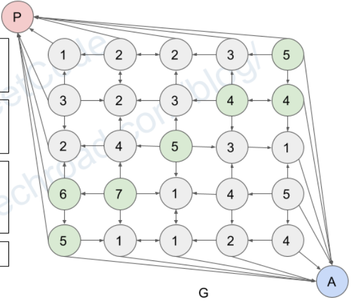

# 417. Pacific Atlantic Water Flow

## 題目

---

There is an `m x n` rectangular island that borders both the **Pacific Ocean** and **Atlantic Ocean**. The **Pacific Ocean** touches the island's left and top edges, and the **Atlantic Ocean** touches the island's right and bottom edges.

The island is partitioned into a grid of square cells. You are given an `m x n` integer matrix `heights` where `heights[r][c]` represents the **height above sea level** of the cell at coordinate `(r, c)`.

The island receives a lot of rain, and the rain water can flow to neighboring cells directly north, south, east, and west if the neighboring cell's height is **less than or equal to** the current cell's height. Water can flow from any cell adjacent to an ocean into the ocean.

Return *a **2D list** of grid coordinates* `result` *where* `result[i] = [ri, ci]` *denotes that rain water can flow from cell* `(ri, ci)` *to **both** the Pacific and Atlantic oceans*.

**Example 1:**


```
Input: heights = [[1,2,2,3,5],[3,2,3,4,4],[2,4,5,3,1],[6,7,1,4,5],[5,1,1,2,4]]
Output: [[0,4],[1,3],[1,4],[2,2],[3,0],[3,1],[4,0]]
Explanation: The following cells can flow to the Pacific and Atlantic oceans, as shown below:
[0,4]: [0,4] -> Pacific Ocean
       [0,4] -> Atlantic Ocean
[1,3]: [1,3] -> [0,3] -> Pacific Ocean
       [1,3] -> [1,4] -> Atlantic Ocean
[1,4]: [1,4] -> [1,3] -> [0,3] -> Pacific Ocean
       [1,4] -> Atlantic Ocean
[2,2]: [2,2] -> [1,2] -> [0,2] -> Pacific Ocean
       [2,2] -> [2,3] -> [2,4] -> Atlantic Ocean
[3,0]: [3,0] -> Pacific Ocean
       [3,0] -> [4,0] -> Atlantic Ocean
[3,1]: [3,1] -> [3,0] -> Pacific Ocean
       [3,1] -> [4,1] -> Atlantic Ocean
[4,0]: [4,0] -> Pacific Ocean
       [4,0] -> Atlantic Ocean
Note that there are other possible paths for these cells to flow to the Pacific and Atlantic oceans.

```

**Example 2:**

```
Input: heights = [[1]]
Output: [[0,0]]
Explanation: The water can flow from the only cell to the Pacific and Atlantic oceans.

```

**Constraints:**

- `m == heights.length`
- `n == heights[r].length`
- `1 <= m, n <= 200`
- `0 <= heights[r][c] <= 10^5`

## 思路

---

- Depth First Serach
    - find all node can reach Pacific, start from first row or first cols
    - find all node can reach Atlantic, start from last row or last cols
    - the intersection of  node collection can reach Pacific and node collection can reach Atlantic is the answer



## Code

---

- GoLang - Depth First Serach
    
    Time Complexity: O(m * n)
    
    Space Complexity:  O(m * n)
    
    Runtime **31 ms** Beats **87.86%**
    
    Memory **6.9 MB** Beats **98.27%**
    
    ```go
    func pacificAtlantic(heights [][]int) [][]int {
        rows, cols := len(heights), len(heights[0])
    
        pacificMap, atlanticMap := make(map[int]bool), make(map[int]bool)
    
        var dfs func(int, int, map[int]bool, int)
        dfs = func(r, c int, visit map[int]bool, prevHeight int) {
            if 
                visit[r*cols + c] || 
                r < 0 || c < 0 || 
                r == rows || c == cols || 
                heights[r][c] < prevHeight {
                return
            }
            visit[r*cols + c] = true
            dfs(r + 1, c, visit, heights[r][c])
            dfs(r - 1, c, visit, heights[r][c])
            dfs(r, c + 1, visit, heights[r][c])
            dfs(r, c - 1, visit, heights[r][c])
        }
    
        for c := 0; c < cols; c++ {
            dfs(0, c, pacificMap, heights[0][c])
            dfs(rows - 1, c, atlanticMap, heights[rows - 1][c])
        }
    
        for r := 0; r < rows; r++ {
            dfs(r, 0, pacificMap, heights[r][0])
            dfs(r, cols - 1, atlanticMap, heights[r][cols - 1])
        }
    
        result := make([][]int, 0)
        for r := 0; r < rows; r++ {
            for c := 0; c < cols; c++ {
                if pacificMap[r*cols + c] && atlanticMap[r*cols + c] {
                    result = append(result, []int{r, c})
                }
            }
        }
        
        return result
    }
    ```
    

## Reference

---

- [https://www.youtube.com/watch?v=s-VkcjHqkGI&ab_channel=NeetCode](https://www.youtube.com/watch?v=s-VkcjHqkGI&ab_channel=NeetCode)
- [https://zxi.mytechroad.com/blog/searching/417-pacific-atlantic-water-flow/](https://zxi.mytechroad.com/blog/searching/417-pacific-atlantic-water-flow/)