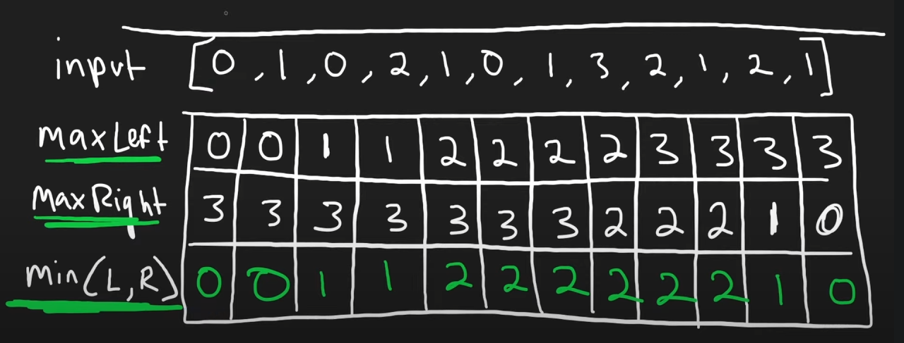
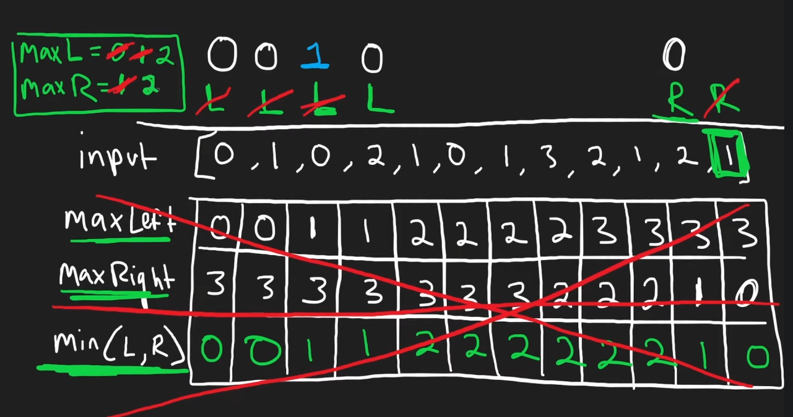

# 42. Trapping Rain Water

## Problem

---

Given `n` non-negative integers representing an elevation map where the width of each bar is `1`, compute how much water it can trap after raining.

**Example 1:**


```
Input: height = [0,1,0,2,1,0,1,3,2,1,2,1]
Output: 6
Explanation: The above elevation map (black section) is represented by array [0,1,0,2,1,0,1,3,2,1,2,1]. In this case, 6 units of rain water (blue section) are being trapped.

```

**Example 2:**

```
Input: height = [4,2,0,3,2,5]
Output: 9

```

**Constraints:**

- `n == height.length`
- `1 <= n <= 2 * 10^4`
- `0 <= height[i] <= 10^5`

## Note

---

- How much  water can trap for a position is  `min(max of left heigh, max of right heigh) - this position’s height` , `water[i] = min(maxLeftHeight[i] , maxRightHeigh) -height[i]`
- Brutal Force to record every maxLeft, maxRight and min(LeftMax, RightMax)
    
    
    
- Two Pointer Approach
    
    We want to  min of Left
    
    
    

## Code

---

- GoLang
    
    Time Complexity: `O(n)`
    
    Space Complexity: `O(1)`
    
    Runtime **7**ms Beats **88.00%** of users with Go
    
    Memory **5.41**MB Beats **52.75%** of users with Go
    
    ```go
    func trap(height []int) int {
        if len(height) < 3 {
            return 0
        }
    
        left, right := 0, len(height) - 1
        maxLeft, maxRight := height[left], height[right]
        result  := 0
        for left < right {
            if maxLeft < maxRight {
                left++
    
                if maxLeft - height[left] > 0 {
                    result += maxLeft - height[left]
                }
    
                maxLeft = max(maxLeft, height[left])
            } else {
                right--
                if maxRight - height[right] > 0 {
                    result += maxRight - height[right]
                }
    
                maxRight = max(maxRight, height[right])
            }
        }
    
        return result
    }
    ```
    

## Reference

---

- [https://www.youtube.com/watch?v=ZI2z5pq0TqA&ab_channel=NeetCode](https://www.youtube.com/watch?v=ZI2z5pq0TqA&ab_channel=NeetCode)