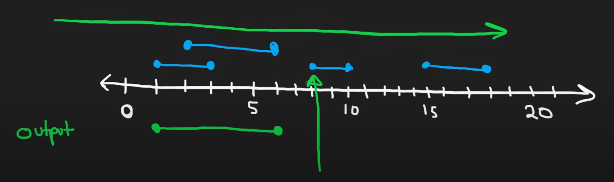

# 56. Merge Intervals

## 題目

---

Given an array of `intervals` where `intervals[i] = [starti, endi]`, merge all overlapping intervals, and return *an array of the non-overlapping intervals that cover all the intervals in the input*.

**Example 1:**

```
Input: intervals = [[1,3],[2,6],[8,10],[15,18]]
Output: [[1,6],[8,10],[15,18]]
Explanation: Since intervals [1,3] and [2,6] overlap, merge them into [1,6].

```

**Example 2:**

```
Input: intervals = [[1,4],[4,5]]
Output: [[1,5]]
Explanation: Intervals [1,4] and [4,5] are considered overlapping.

```

**Constraints:**

- `1 <= intervals.length <= 10^4`
- `intervals[i].length == 2`
- `0 <= starti <= endi <= 10^4`

## 思路

---

1. Sort array by start of interval
2. check one by one, compare to the last intervals in result
    1. If end of  last interval in result  less than start of current interval, mean not overlap. append it.
    2. If end of last interval in result less than end of current interval, mean overlap, merge it.



## Code

---

- GoLang
    
    Runtime **30**ms **Beats 14.52%**of users with Go
    
    Memory **6.34**MB **Beats 98.27%**of users with Go
    
    - Time Complexity: `O(nlogn)`, n is length of intervals
    - Space Complexity: `O(n)`
    
    ```go
    import "sort"
    
    func merge(intervals [][]int) [][]int {
        // sort by start of intervals
        sort.SliceStable(intervals, func(i, j int) bool {
            return intervals[i][0] < intervals[j][0]
        })
    
        result := [][]int{intervals[0]}
    
        for i := 0; i < len(intervals); i++ {
            resultLastIndex := len(result) - 1
            lastResult := result[resultLastIndex]
            current := intervals[i]
    
            // not overlap
            if lastResult[1] < current[0] {
                result = append(result, current)
            } else if lastResult[1] < current[1] {
                // overlap, merge get new interval
                result[resultLastIndex][1] = current[1]
            }
        }
    
        return result
    }
    ```
    

## Reference

---

- [https://www.youtube.com/watch?v=44H3cEC2fFM&ab_channel=NeetCode](https://www.youtube.com/watch?v=44H3cEC2fFM&ab_channel=NeetCode)