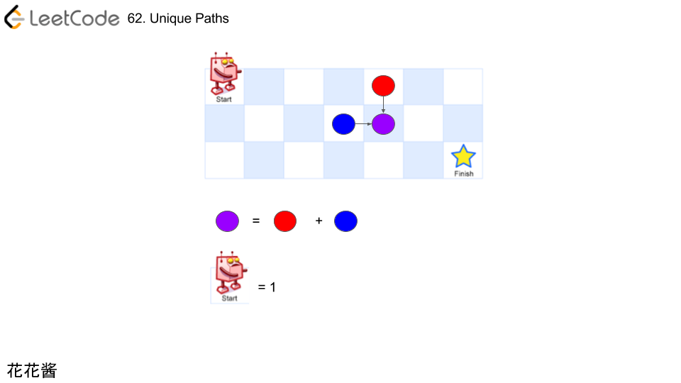
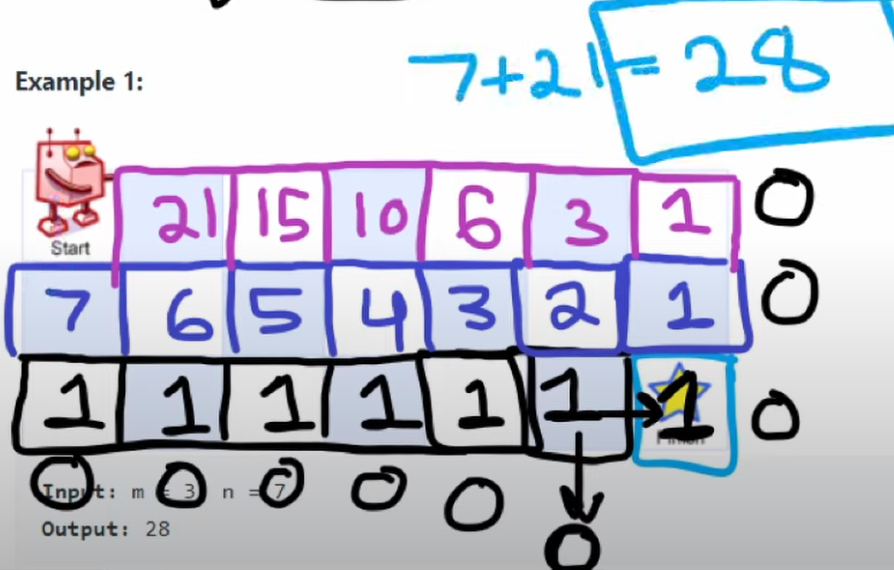

# 62. Unique Paths

## 題目

---

There is a robot on an `m x n` grid. The robot is initially located at the **top-left corner** (i.e., `grid[0][0]`). The robot tries to move to the **bottom-right corner** (i.e., `grid[m - 1][n - 1]`). The robot can only move either down or right at any point in time.

Given the two integers `m` and `n`, return *the number of possible unique paths that the robot can take to reach the bottom-right corner*.

The test cases are generated so that the answer will be less than or equal to `2 * 109`.

**Example 1:**


```
Input: m = 3, n = 7
Output: 28

```

**Example 2:**

```
Input: m = 3, n = 2
Output: 3
Explanation: From the top-left corner, there are a total of 3 ways to reach the bottom-right corner:
1. Right -> Down -> Down
2. Down -> Down -> Right
3. Down -> Right -> Down

```

**Constraints:**

- `1 <= m, n <= 100`

## 思路

---

- the unique path to first row or first line must be one
- dp[m][n] = dp[m-1][n] + dp[m][n-1]





## Code

---

- GoLang
    
    Dynamic problem
    
    Runtime**0 ms** Beats **100%**
    
    Memory**1.9 MB** Beats **75.84%**
    
    - Time Complexity: `O(n*m)`
    - Space Complexity: `O(n)`
    
    ```go
    func uniquePaths(m int, n int) int {
        // declare
        grid := make([][]int, m)
        for i := 0; i < m; i++ {
            grid[i] = make([]int, n)
        }
    
        for i := 0; i < m; i++ {
            for j := 0; j < n; j++ {
                // the way to first row or first line must be 1
                if i == 0 || j == 0 {
                    grid[i][j] = 1
                    continue;
                }
    
                grid[i][j] = grid[i-1][j] + grid[i][j-1]
            }
        }
    
        return grid[m-1][n-1]
    }
    ```
    

## Reference

---

- [https://www.youtube.com/watch?v=IlEsdxuD4lY&ab_channel=NeetCode](https://www.youtube.com/watch?v=IlEsdxuD4lY&ab_channel=NeetCode)
- **[花花酱 LeetCode 62. Unique Paths](https://zxi.mytechroad.com/blog/dynamic-programming/leetcode-62-unique-paths/)**
- ****[[Day 22] 從LeetCode學演算法 - 0062. Unique Paths (Medium)](https://ithelp.ithome.com.tw/articles/10213284)****
- **[[LeetCode] 62. Unique Paths 不同的路径](https://www.cnblogs.com/grandyang/p/4353555.html)**