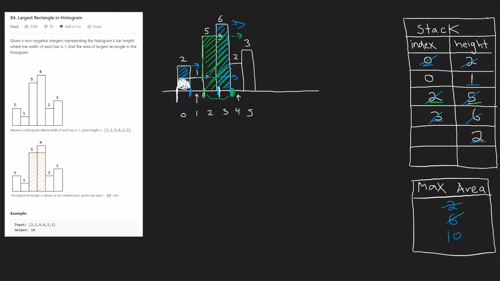
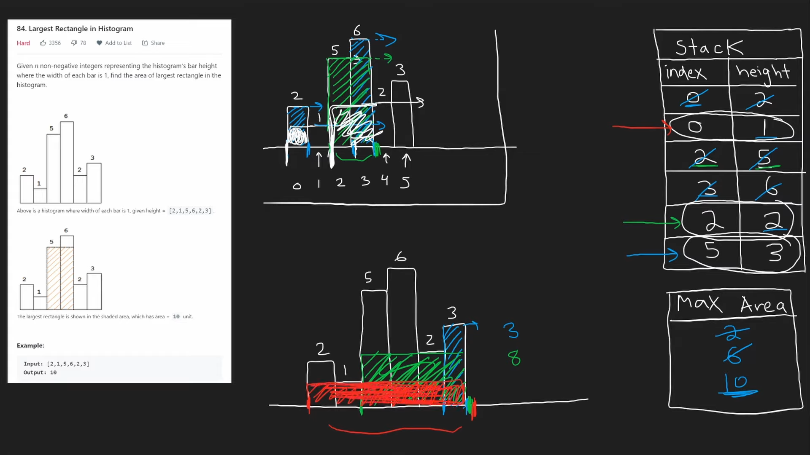

# 84. Largest Rectangle in Histogram

## Problem

---

Given an array of integers `heights` representing the histogram's bar height where the width of each bar is `1`, return *the area of the largest rectangle in the histogram*.

**Example 1:**


```
Input: heights = [2,1,5,6,2,3]
Output: 10
Explanation: The above is a histogram where width of each bar is 1.
The largest rectangle is shown in the red area, which has an area = 10 units.

```

**Example 2:**


```
Input: heights = [2,4]
Output: 4

```

**Constraints:**

- `1 <= heights.length <= 10^5`
- `0 <= heights[i] <= 10^4`

## Note

---

1. Using Monotonic Stack to store index, height pair
    1. start pop pair when `stack.Peek()` > `height[i+1]`
2. calculate rectangle in middle first when poping.
3. calculate rest area by iterating pairs in stack.





## Code

---

- PHP
    
    Time Complexity: `O(n)`
    
    Space Complexity: `O(n)`
    
    Runtime **312**ms Beats **42.86%**of users with PHP
    
    Memory **48.68**MB Beats**14.29%**of users with PHP
    
    ```php
    class Solution {
    
        /**
         * @param Integer[] $heights
         * @return Integer
         */
        function largestRectangleArea($heights) {
            $maxArea = 0;
            $stack = []; // pair: [height, index]
            
            foreach ($heights as $i => $height) {
                $startIndex = $i;
                while (count($stack) > 0 && $stack[count($stack)-1][0] > $height) {
                    $pair = $stack[count($stack) - 1];
                    $maxArea = max($maxArea, $pair[0] * ($i - $pair[1]));
                    array_pop($stack);
                    $startIndex = $pair[1];
                }
                
                $stack[] = [$height, $startIndex];
            }
    
            foreach ($stack as $pair) {
                $maxArea = max($maxArea, $pair[0] * (count($heights) - $pair[1]));
            }
    
            return $maxArea;
        }
    }
    ```
    

- GoLang
    
    Time Complexity: `O(n)`
    
    Space Complexity: `O(n)`
    
    Runtime **93**ms Beats **82.12%** of users with Go
    
    Memory **13.15**MBBeats **18.13%**of users with Go
    
    ```go
    
    func largestRectangleArea(heights []int) int {
        maxArea := 0
        stack := [][2]int{} // pair: {height, index}
    
        for i := 0; i < len(heights); i++ {
            startIdx := i
            for len(stack) > 0 && stack[len(stack)-1][0] > heights[i] {
                pair := stack[len(stack)-1]
                stack = stack[:len(stack)-1]
                maxArea = max(maxArea, pair[0] * (i - pair[1]))
                startIdx = pair[1]
            }
    
            stack = append(stack, [2]int{heights[i], startIdx})
        }
    
        // calculate multiple histogram rectangle
        for _, pair := range stack {
            maxArea = max(maxArea, pair[0] * (len(heights) - pair[1]))
        }
    
        return maxArea
    }
    ```
    

## Reference
- https://www.youtube.com/watch?v=zx5Sw9130L0&ab_channel=NeetCode

---