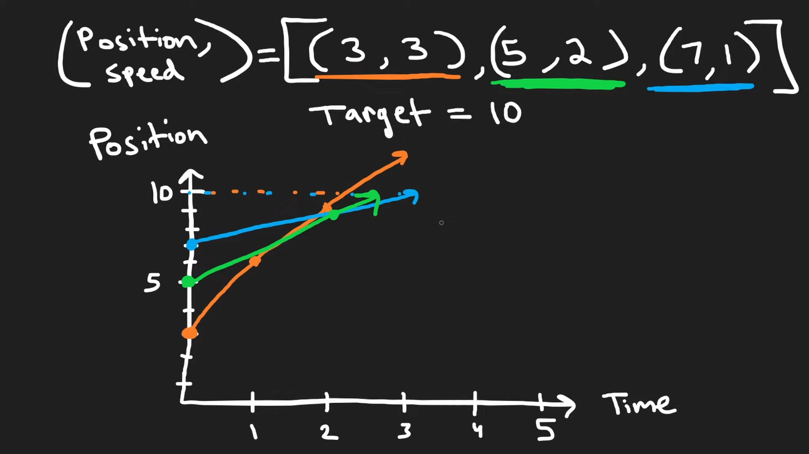
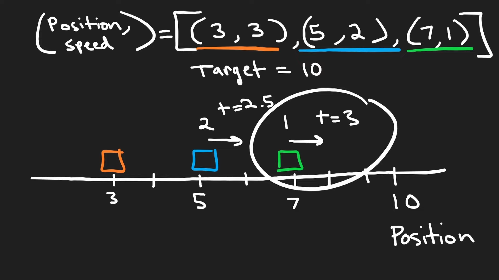

# 853. Car Fleet

## Problem

---

There are `n` cars going to the same destination along a one-lane road. The destination is `target` miles away.

You are given two integer array `position` and `speed`, both of length `n`, where `position[i]` is the position of the `ith` car and `speed[i]` is the speed of the `ith` car (in miles per hour).

A car can never pass another car ahead of it, but it can catch up to it and drive bumper to bumper **at the same speed**. The faster car will **slow down** to match the slower car's speed. The distance between these two cars is ignored (i.e., they are assumed to have the same position).

A **car fleet** is some non-empty set of cars driving at the same position and same speed. Note that a single car is also a car fleet.

If a car catches up to a car fleet right at the destination point, it will still be considered as one car fleet.

Return *the **number of car fleets** that will arrive at the destination*.

**Example 1:**

```
Input: target = 12, position = [10,8,0,5,3], speed = [2,4,1,1,3]
Output: 3
Explanation:
The cars starting at 10 (speed 2) and 8 (speed 4) become a fleet, meeting each other at 12.
The car starting at 0 does not catch up to any other car, so it is a fleet by itself.
The cars starting at 5 (speed 1) and 3 (speed 3) become a fleet, meeting each other at 6. The fleet moves at speed 1 until it reaches target.
Note that no other cars meet these fleets before the destination, so the answer is 3.

```

**Example 2:**

```
Input: target = 10, position = [3], speed = [3]
Output: 1
Explanation: There is only one car, hence there is only one fleet.

```

**Example 3:**

```
Input: target = 100, position = [0,2,4], speed = [4,2,1]
Output: 1
Explanation:
The cars starting at 0 (speed 4) and 2 (speed 2) become a fleet, meeting each other at 4. The fleet moves at speed 2.
Then, the fleet (speed 2) and the car starting at 4 (speed 1) become one fleet, meeting each other at 6. The fleet moves at speed 1 until it reaches target.
```

**Constraints:**

- `n == position.length == speed.length`
- `1 <= n <= 10^5`
- `0 < target <= 10^6`
- `0 <= position[i] < target`
- All the values of `position` are **unique**.
- `0 < speed[i] <= 10^6`

## Note

---

1. If ahead car's `time of reaching` is larger than behind car, these two fleet
2. To order by car’s position, need sort → `O(nlogn)`
3. Need to maintain decreasing order , otherwise need to remove it. (time of reaching decreasing mean can fleet)
    
    → using `Monotonic Decreasing Stack`
    
4. Monotonic Decreasing Stack to stored `time of reaching`
5. Pop value if ahead car's time of reaching is larger.
    
    Because if head car's time of reaching is smaller than behind car, these two car never fleet
    





## Code

---

- PHP
    
    Time Complexity: `O(nlong)` , `nlogn` by sorting
    
    Space Complexity: `O(n)`
    
    Runtime **781**ms Beats **16.67%**of users with PHP
    
    Memory **53.62**MB Beats **16.67%**of users with PHP
    
    ```php
    class Solution {
    
        /**
         * @param Integer $target
         * @param Integer[] $position
         * @param Integer[] $speed
         * @return Integer
         */
        function carFleet($target, $position, $speed) {
            $stack = [];
            $carInfos = [];
            $length = count($position);
            for ($i = 0; $i < $length; $i++) {
                $carInfos[$i] = [$position[$i], $speed[$i]];
            }
    
            usort($carInfos, function($i, $j) {
                return $i[0] < $j[0];
            });
    
            for ($i = 0; $i < $length; $i++) {
                $stack[] = ($target - $carInfos[$i][0]) / $carInfos[$i][1];
                if (count($stack) >= 2 && $stack[count($stack) - 1] <= $stack[count($stack) - 2]) {
                    array_pop($stack);
                }
            }
    
            return count($stack);
        }
    }
    ```
    

- GoLang
    
    Time Complexity: `O(nlong)` , `nlogn` by sorting
    
    Space Complexity: `O(n)`
    
    Runtime **154**ms Beats **83.24%** of users with Go
    
    Memory **10.13**MB Beats **67.94%** of users with Go
    
    ```go
    func carFleet(target int, position []int, speed []int) int {
        carInfos := make([][2]int, len(position))
        for i := 0; i < len(position); i++ {
            carInfos[i] = [2]int{position[i], speed[i]}
        }
    
        // reversed order
        sort.Slice(carInfos, func(i, j int) bool {
            return carInfos[i][0] > carInfos[j][0]
        })
        
        stack := []float32{}
    
        for i := 0; i < len(position); i++ {
            // push time of reaching to target into stack
            stack = append(stack, float32(target-carInfos[i][0]) / float32(carInfos[i][1]))
            // if ahead car's time of reaching is larger than behind car, these two fleet
            // Pop value if ahead car's time of reaching is larger.
            // Because if head car's time of reaching is smaller than behind car, these two car never fleet
            if len(stack) >= 2 && stack[len(stack)-1] <= stack[len(stack)-2] {
                stack = stack[:len(stack)-1]
            }
        }
    
        return len(stack)
    }
    ```
    

## Reference

---